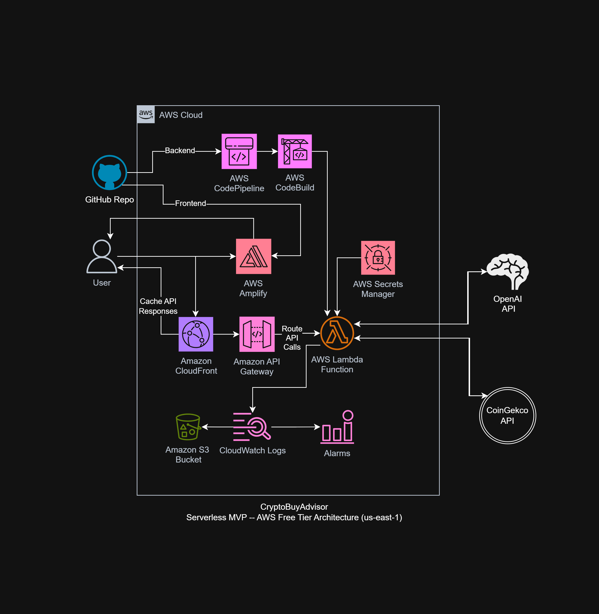

# CryptoBuyAdvisor

**An AI-powered crypto insight tool built on the AWS Free Tier.**
It doesn’t just suggest what to buy; it warns you when to be cautious!

---

## Project Goals

CryptoBuyAdvisor is a cloud-native application that:
- Fetches real-time data from public crypto APIs
- Uses OpenAI’s GPT API to provide natural-language recommendations
- Alerts users to risky or hype-driven coins (e.g., meme coins, cash-grab coins, etc)
- Is fully serverless and scalable using AWS Free Tier components

This project also prioritizes ethical crypto awareness—helping users understand not just *what* to buy, but *why* they should be cautious.

---

## Current Working Architecture and Application

> *Check out the [original architecture diagram](docs/Unofficial-AWS-Architecture.png) to appreciate the updates!*

Notes about this diagram:
- Region us-east-1 chosen because all AWS services are guaranteed to be available (even though I am located in Texas)
- WAF is NOT a free tier service (and pricy), so this was excluded from MVP, but it is highly recommend for security! 
- Services are outside of a VPC since app is making calls to public APIs.

🔗 Live Demo

👉 [Click here to view the hosted MVP frontend]([http://crypto-buy-advisor-site.s3-website.us-east-2.amazonaws.com](https://main.d12k8nnoyk6p4v.amplifyapp.com/))

### Stack (So far):
- ✔️ AWS S3 (cloudwatch logs)
- ✔️ AWS Lambda (scaffolded)
- AWS CloudFront (possibly cache for lambda)
- API Gateway (planned)
- AWS Secrets Manager (planned)
- OpenAI GPT API (planned)
- CoinGecko API (planned)
- ✔️ AWS CodePipeline (GitHub integration)
- ✔️ AWS Amplify (GitHub integration)
- ✔️ AWS CodeBuild (GitHub integration)
- ✔️ CloudWatch Logs/Alarms (planned)
- AWS WAF (wishlist)

---

## DevOps & CI/CD Setup

CryptoBuyAdvisor is integrated with AWS CodePipeline (backend) and AWS Amplify (frontend) to enable continuous delivery.
- GitHub → CodePipeline/CodeBuild → Lambda Deployment (planned)
  > *A change to `/backend/lambda_function.py` will automatically trigger redeployment once the pipeline is active.*
  
- GitHub → AWS Amplify → Website/App front (planned)
  > *A change to `/frontend/index.html` will automatically trigger redeployment.*
  
- Dev workflow is CI-ready for future integration with GitHub Actions

---

## Why I Built This

I recently passed the AWS Certified Solutions Architect – Associate exam. This project puts those concepts into practice. My goal is to build something intelligent, scalable, and ethically responsible.

Check back soon for live demos, trust scores, and a GPT-powered crypto advisor.

---

## Financials

CryptoBuyAdvisor was designed to stay fully within the AWS Free Tier during MVP development.

### AWS
> AWS Services: $3.28/month
### GPT: gpt-3.5-turbo-0125 model
Input: $0.0005 per 1,000 tokens.
Output: $0.0015 per 1,000 tokens.
See working prompt here!
> GPT API: $5.32/month

### Total
> **$8.60/month**

You can review the official AWS Pricing Calculator estimate here: [AWS Price Estimate (PDF)](./docs/AWS-Pricing-Estimate-05272025.pdf)

### Management and Cost Monitoring Services
Tools used:
- AWS Budget
- AWS Cost Anomaly Detection (excluded because AWS Budget + Cost Explorer sufficient for MVP)
- Cost Explorer

MVP designed to stay in the free tier, so management and cost monitioring services (AWS Budgets + SNS, and Cost Anomaly Detection) are free for the scale of this project.

---

## Coming Soon

- Live crypto query interface
- Risk scoring system
- GPT-powered natural-language recommendations
- Trust score display
- Secure & scalable deployment pipeline
